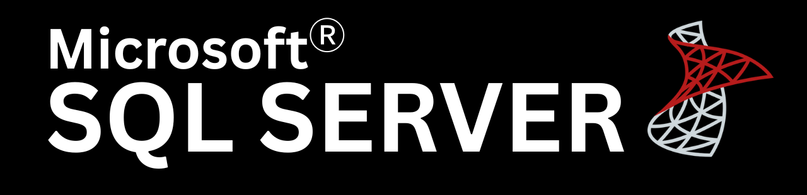
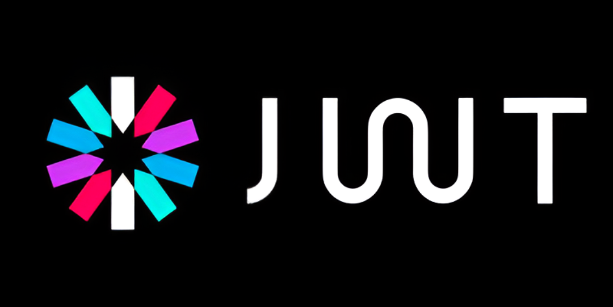

# Hi, I'm Faiz 

### 👨‍💻 Who am I?
I am a **Full Stack Developer** specializing in **Angular** and **.NET**. I focus on building clean, production-grade architectures and modern, responsive front-end designs.

###  Currently working on
* **[Shoe E-commerce API](https://github.com/Faiz-mohamed/ShoeEcommerce-CleanArchitecture-API):** A production-ready REST API built with .NET, Clean Architecture, and Razorpay integration.

### 🛠️ Tools I Use

  

  

  

  

  

  

### 📫 How to reach me
* 
* 
